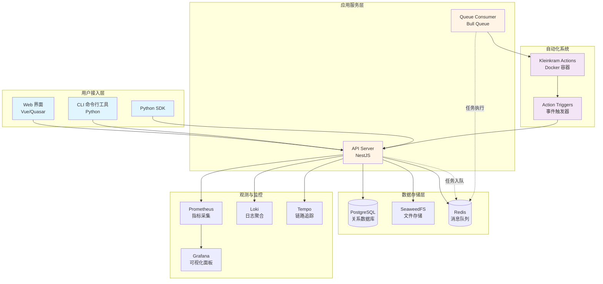

Kleinkram 是一个**开源的机器人数据管理平台**,专为机器人实验室和研发团队设计。它提供了结构化的数据存储、自动化数据处理和精细化的访问控制能力,让团队能够高效地管理和协作处理大规模机器人数据集。无论是 ROS bags、MCAP 文件还是其他机器人数据格式,Kleinkram 都能提供统一的存储、组织和自动化处理方案。

Sources: [README.md](README.md#L1-L16)

## 核心能力

Kleinkram 围绕机器人数据管理的核心需求,构建了四大核心能力模块:

**结构化存储体系** 提供项目→任务→文件的三级层级结构,支持对机器人数据进行系统化组织。每个层级都有独立的访问权限控制和元数据管理,确保数据的安全性和可追溯性。平台原生支持 ROS bags(.bag, .mcap)、ZED 相机录制文件(.svo2)以及配置文件等常见机器人数据格式。

**自动化处理引擎** 通过 Kleinkram Actions 系统,用户可以定义和运行各种数据处理流水线。系统内置了数据验证、格式转换、元数据提取等常用 Action,同时也支持使用 Docker 容器编写自定义处理逻辑。配合 Action Triggers,可以实现文件上传时的自动触发处理,大幅提升数据处理效率。

**多端协作工具** 提供了完整的 Web 界面、命令行工具(CLI)和 Python SDK,满足不同使用场景的需求。研究人员可以通过浏览器直观浏览和管理数据,开发人员可以使用 CLI 和 SDK 自动化数据上传下载流程,实现与 CI/CD 系统的无缝集成。

**企业级权限系统** 实现了基于访问组的细粒度权限控制,支持项目级和任务级的读写权限管理。管理员可以灵活配置团队成员的访问范围,确保敏感数据的安全性,同时又不影响团队的正常协作。

Sources: [README.md](README.md#L6-L11), [docs/index.md](docs/index.md#L21-L42)

## 系统架构

Kleinkram 采用**微服务架构**设计,通过 Docker Compose 编排多个独立服务组件。这种架构既保证了各服务的独立性和可扩展性,又通过容器化部署降低了运维复杂度。系统核心由前端应用、后端 API 服务、队列消费者和存储服务组成,各服务之间通过消息队列和共享数据库进行协同。



**前端应用** 基于 Vue 3 和 Quasar Framework 构建,提供了直观的数据浏览、上传和管理界面。用户可以通过 Web UI 查看项目结构、预览文件元数据、配置访问权限以及监控 Actions 的执行状态。前端通过 RESTful API 与后端通信,支持实时数据更新和响应式布局。

**后端 API 服务** 是系统的核心枢纽,采用 NestJS 框架开发,实现了所有业务逻辑和 REST API 端点。后端负责用户认证授权、数据校验、权限检查以及与数据库和文件存储的交互。通过 TypeORM 管理数据库实体,通过 OpenTelemetry 实现分布式追踪,并通过 Swagger 自动生成 API 文档。

**队列消费者** 独立运行的后台任务处理服务,通过 Bull 队列与 Redis 进行任务调度。负责执行耗时的文件处理任务,如元数据提取、格式转换、文件清理等。这种异步处理机制确保了 API 服务的高响应性,同时支持任务的失败重试和进度跟踪。

**Actions 自动化系统** 基于 Docker 容器的可扩展处理引擎。每个 Action 都是一个独立的 Docker 容器,可以执行任意数据处理逻辑。系统提供了标准化的输入输出接口,支持 GPU 加速和分布式执行。Action Triggers 允许用户定义事件驱动的自动化规则,实现文件上传时的自动处理流水线。

Sources: [docker-compose.yml](docker-compose.yml#L1-L80), [backend/src/main.ts](backend/src/main.ts#L1-L165), [backend/src/app.module.ts](backend/src/app.module.ts#L1-L123), [queueConsumer/src/app.module.ts](queueConsumer/src/app.module.ts#L1-L127)

## 技术栈概览

| 层级 | 技术组件 | 用途说明 |
|------|---------|---------|
| **前端框架** | Vue 3 + Quasar Framework | 构建响应式单页应用,提供丰富的 UI 组件库 |
| | TypeScript | 类型安全的 JavaScript 超集,提升代码质量 |
| | Vite | 新一代构建工具,提供极速的开发体验 |
| **后端框架** | NestJS | 企业级 Node.js 框架,支持模块化架构 |
| | TypeORM | TypeScript ORM,管理数据库实体和迁移 |
| | Passport.js | 认证中间件,支持 OAuth 和 JWT |
| | Bull Queue | 基于 Redis 的任务队列系统 |
| **CLI 工具** | Python 3.8+ | CLI 和 SDK 的实现语言 |
| | Typer | 现代 Python CLI 框架,提供自动补全 |
| | Rich | 终端美化库,输出彩色表格和进度条 |
| **数据库** | PostgreSQL | 主数据库,存储结构化数据 |
| | Redis | 缓存、会话存储和消息队列 |
| **文件存储** | SeaweedFS | 分布式文件存储系统,支持大文件分片 |
| **容器编排** | Docker Compose | 多容器应用的编排和管理工具 |
| **监控观测** | Prometheus | 指标采集和监控告警系统 |
| | Grafana | 监控数据可视化面板 |
| | Loki | 日志聚合系统 |
| | Tempo | 分布式链路追踪系统 |
| | OpenTelemetry | 可观测性标准和工具集 |

Sources: [package.json](package.json#L1-L90), [backend/package.json](backend/package.json#L1-L128), [frontend/package.json](frontend/package.json#L1-L69)

## 项目目录结构

Kleinkram 采用 **Monorepo 架构**,将多个相关项目集中在单一仓库中管理。这种架构有利于代码共享、统一版本管理和依赖协调。项目根目录使用 pnpm workspace 管理多个子包,每个子包都有独立的 package.json 和 TypeScript 配置。

```
kleinkram/
├── backend/              # NestJS 后端服务
│   ├── src/              # 源代码目录
│   │   ├── endpoints/    # API 端点和控制器
│   │   ├── services/     # 业务逻辑层
│   │   └── routing/      # 路由、中间件和守卫
│   ├── tests/            # 单元测试和集成测试
│   └── migration/        # 数据库迁移脚本
│
├── frontend/             # Vue 前端应用
│   ├── src/              # 源代码目录
│   │   ├── pages/        # 页面组件
│   │   ├── components/   # 可复用组件
│   │   └── api/          # API 客户端
│   └── public/           # 静态资源
│
├── cli/                  # Python CLI 工具
│   ├── kleinkram/        # 主包源代码
│   │   ├── cli/          # 命令行接口定义
│   │   ├── api/          # API 客户端封装
│   │   └── core/         # 核心业务逻辑
│   └── tests/            # CLI 测试套件
│
├── queueConsumer/        # 后台任务消费者
│   └── src/              # 任务处理器源代码
│
├── packages/             # 共享包(Monorepo 子包)
│   ├── api-dto/          # API 数据传输对象
│   ├── backend-common/   # 后端公共代码
│   ├── shared/           # 前后端共享代码
│   └── validation/       # 验证逻辑和装饰器
│
├── examples/             # Actions 示例
│   └── kleinkram-actions/
│       ├── convert-formats/      # 格式转换示例
│       ├── extract-metadata/     # 元数据提取示例
│       ├── validate-data/        # 数据验证示例
│       └── python-template/      # Python Action 模板
│
├── docs/                 # VitePress 文档站点
│   ├── usage/            # 用户使用文档
│   └── development/      # 开发者文档
│
├── observability/        # 监控配置
│   ├── grafana/          # Grafana 仪表板
│   ├── prometheus/       # Prometheus 配置
│   ├── loki/             # Loki 日志配置
│   └── tempo/            # Tempo 追踪配置
│
└── docker/               # Dockerfile 定义
    ├── backend.Dockerfile
    ├── frontend.Dockerfile
    └── queue-consumer.Dockerfile
```

**packages/** 目录是 Monorepo 架构的核心,包含了跨服务共享的代码。**api-dto** 定义了 API 的数据传输对象,确保前后端类型一致;**backend-common** 包含后端服务和队列消费者共享的实体定义、数据库配置和工具函数;**shared** 包含前后端通用的类型定义和常量;**validation** 提供了统一的输入验证装饰器和逻辑。

**examples/kleinkram-actions/** 提供了多个开箱即用的 Action 示例,开发者可以参考这些模板快速编写自定义的自动化处理流程。每个示例都包含完整的 Dockerfile、入口脚本和说明文档,展示了如何与 Kleinkram 系统集成。

Sources: [package.json](package.json#L31-L37), [pnpm-workspace.yaml](pnpm-workspace.yaml#L1)

## 核心服务详解

### 后端 API 服务

后端服务采用 NestJS 的**模块化架构**,每个业务域都有独立的模块、控制器和服务。从 [backend/src/endpoints](backend/src/endpoints) 目录结构可以看到,系统实现了 15 个核心功能模块:

| 模块名称 | 职责范围 | 核心功能 |
|---------|---------|---------|
| **Project** | 项目管理 | 创建、查询、更新、删除项目,管理项目访问权限 |
| **Mission** | 任务管理 | 在项目下创建任务,管理任务元数据和文件列表 |
| **File** | 文件管理 | 文件上传、下载、元数据提取、文件验证 |
| **Auth** | 认证授权 | OAuth 认证、JWT 令牌管理、API Key 验证 |
| **Access** | 访问控制 | 访问组管理、权限检查、成员关系维护 |
| **Action** | 自动化处理 | Action 创建、版本管理、执行调度 |
| **Trigger** | 事件触发器 | 定义触发规则,响应文件上传等事件 |
| **User** | 用户管理 | 用户信息查询、用户权限关系 |
| **Tag** | 标签系统 | 标签类型定义、标签应用与查询 |
| **Topic** | ROS Topic 管理 | Topic 元数据管理、消息类型定义 |

每个模块都遵循 NestJS 的分层架构:**Controller** 处理 HTTP 请求和参数验证,**Service** 实现业务逻辑和数据访问,**Module** 组织依赖注入关系。通过 TypeORM 的 Repository 模式实现数据持久化,通过 Guard 和 Interceptor 实现权限检查和请求拦截。

Sources: [backend/src/app.module.ts](backend/src/app.module.ts#L44-L76), [backend/src/endpoints](backend/src/endpoints)

### 前端应用架构

前端应用基于 **Vue 3 Composition API** 和 **Quasar Framework** 构建,采用了现代化的组件化架构。通过 Vue Router 实现多页面路由,通过 TanStack Query 管理服务端状态和缓存。应用启动时通过 Boot Files 注入全局配置、API 客户端和认证逻辑。

前端的核心特性包括:**响应式布局**适配不同屏幕尺寸,**文件分片上传**支持大文件断点续传,**实时数据预览**可视化 ROS bag 内容,**权限管理界面**直观配置访问组和成员权限。前端通过 Axios 与后端 API 通信,所有 API 调用都经过统一的错误处理和重试机制。

Sources: [frontend/package.json](frontend/package.json#L15-L60)

### CLI 工具与 Python SDK

CLI 工具提供了**命令行接口**用于数据管理自动化,基于 Python 的 Typer 框架开发。命令分为三大类:**核心命令**(download, upload, verify, list)处理数据传输,**CRUD 命令**(file, mission, project)管理资源实体,**Action 命令**(action, run)执行自动化任务。

CLI 的核心设计原则是**类型安全**和**用户友好**。通过 Rich 库实现彩色输出和进度显示,通过 Python 类型注解提供 IDE 自动补全支持。CLI 配置存储在 `~/.local/state/kleinkram/` 目录下,支持多端点切换和凭证管理。Python SDK 封装了底层的 HTTP 客户端,提供了面向对象的 API,方便开发者集成到自己的 Python 项目中。

Sources: [cli/kleinkram/cli/app.py](cli/kleinkram/cli/app.py#L1-L200)

## 快速启动流程

Kleinkram 提供了**一键启动**的开发环境,只需 Docker 和 Docker Compose 即可在本地运行完整系统。启动流程会自动构建所有服务镜像、初始化数据库、配置文件存储,并在几分钟后启动完整的开发环境。

```bash
# 克隆仓库
git clone git@github.com:leggedrobotics/kleinkram.git
cd kleinkram

# 启动所有服务(首次运行会构建镜像)
docker compose up --build

# 访问前端界面
# http://localhost:8003

# 配置 CLI 连接本地实例
klein endpoint local
klein login
```

启动后,系统会监听以下端口:**8003** 为前端应用,**3000** 为后端 API,**8333** 为 SeaweedFS 文件存储,**9090** 为 Prometheus,**3000** 为 Grafana。开发者可以通过浏览器访问前端界面进行数据管理,或使用 CLI 工具执行命令行操作。

Sources: [README.md](README.md#L22-L62)

## 下一步学习路径

作为初学者,建议按照以下顺序深入了解 Kleinkram:

首先,从 **[快速开始](2-kuai-su-kai-shi)** 页面学习基本操作流程,体验完整的数据上传、浏览和管理流程。这会帮助你建立对系统整体工作方式的直观认知。

接着,通过 **[核心概念与数据层级](3-he-xin-gai-nian-yu-shu-ju-ceng-ji)** 理解 Project-Mission-File 的三层结构,以及访问组、标签、元数据等核心概念。这是理解系统设计思想的基础。

然后,根据你的使用场景选择学习路径:

- **数据使用者**:学习 **[CLI 安装与配置](4-cli-an-zhuang-yu-pei-zhi)** 和 **[CLI 命令详解](15-cli-ming-ling-xiang-jie)**,掌握命令行工具的使用方法
- **Python 开发者**:学习 **[Python SDK 集成开发](16-python-sdk-ji-cheng-kai-fa)**,了解如何在 Python 代码中调用 Kleinkram API
- **前端开发者**:阅读 **[Vue 组件架构](10-vue-zu-jian-jia-gou)** 和 **[状态管理与路由系统](11-zhuang-tai-guan-li-yu-lu-you-xi-tong)**,理解前端应用的架构设计
- **后端开发者**:学习 **[API 端点与控制器设计](7-api-duan-dian-yu-kong-zhi-qi-she-ji)** 和 **[数据模型与 TypeORM 实体](8-shu-ju-mo-xing-yu-typeorm-shi-ti)**,深入理解后端架构

对于想要扩展系统功能的开发者,建议学习 **[Actions 基础与使用](12-actions-ji-chu-yu-shi-yong)** 和 **[编写自定义 Actions](13-bian-xie-zi-ding-yi-actions)**,了解如何通过 Docker 容器扩展数据处理能力。对于运维人员,**[Docker 容器编排](26-docker-rong-qi-bian-pai)** 和 **[生产环境部署配置](28-sheng-chan-huan-jing-bu-shu-pei-zhi)** 提供了完整的部署和运维指南。