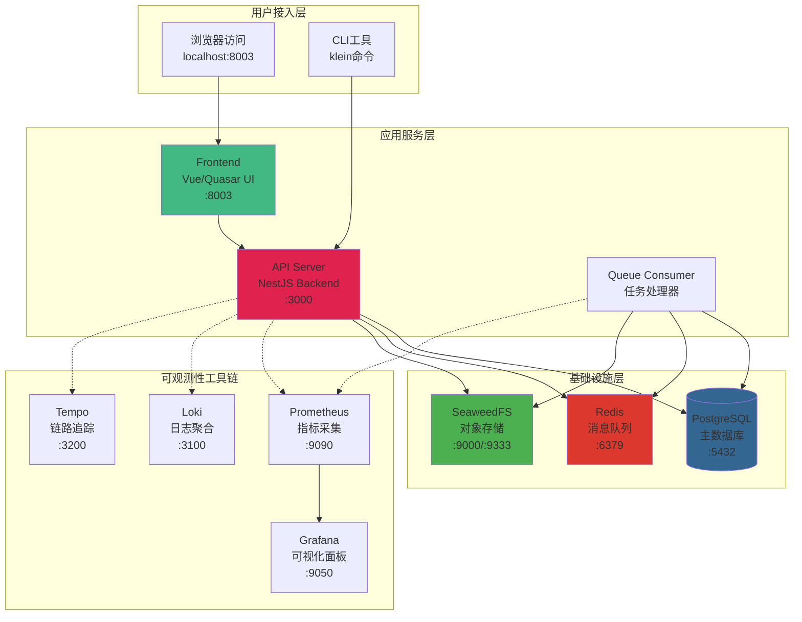

欢迎来到 Kleinkram！本文档将引导您在 **5 分钟内**启动并运行一个完整的本地 Kleinkram 实例。Kleinkram 是一个开源、可自托管的机器人数据管理平台，专为存储、组织和处理机器人数据而设计，支持 ROS bags（.bag、.mcap）、ZED 相机录制文件（.svo2）等格式的结构化管理与自动化处理。

## 系统架构概览

Kleinkram 采用**微服务架构**，通过 Docker Compose 编排多个协同工作的服务。核心服务包括前端界面、后端 API、任务队列消费者、对象存储系统以及可观测性工具链。每个服务专注于特定功能域，通过网络通信实现解耦协作，确保系统具备良好的可扩展性和可维护性。



该架构体现了**分层设计原则**：用户接入层处理外部交互，应用服务层承载核心业务逻辑，基础设施层提供持久化与通信支持，可观测性工具链则保障系统运行状态的可监控性。服务间通过 Docker 网络隔离，确保通信安全与故障隔离。

Sources: [docker-compose.yml](docker-compose.yml#L1-L200), [docker-compose.dev.yml](docker-compose.dev.yml#L1-L228)

## 系统要求

在开始之前，请确保您的开发环境满足以下要求。这些工具是 Kleinkram 运行的基础依赖，其中浏览器兼容性要求源于前端框架在本地开发模式下的已知限制。

| 工具名称 | 最低版本要求 | 用途说明 | 安装验证命令 |
|---------|------------|---------|-------------|
| **Git** | 任意版本 | 克隆源代码仓库 | `git --version` |
| **Docker** | 20.0+ | 容器运行时环境 | `docker --version` |
| **Docker Compose** | 2.0+ | 多容器编排工具 | `docker compose version` |
| **浏览器** | Chrome/Firefox | 访问 Web 界面（Safari 在本地开发环境存在兼容性问题） | - |

**操作系统兼容性**：已在 Ubuntu 24.04 和 macOS 上验证通过。Windows 用户建议使用 WSL2 环境以获得最佳体验。

**硬件资源建议**：最低配置 8GB 内存，推荐 16GB 以确保数据库、对象存储和多个微服务并发运行的流畅性。

Sources: [README.md](README.md#L29-L36), [docs/development/getting-started.md](docs/development/getting-started.md#L15-L24)

## 快速启动步骤

遵循以下步骤，您将在几分钟内启动一个包含示例数据的完整本地环境。整个过程采用**零配置设计**——默认的 `.env` 文件已预设所有必要参数，包括数据库连接、存储桶配置和测试用户凭证。

### 步骤一：获取源代码

```bash
git clone git@github.com:leggedrobotics/kleinkram.git
cd kleinkram
```

克隆操作将获取项目的完整源代码、Docker 配置文件以及示例 Actions 模板。

### 步骤二：启动所有服务

```bash
docker compose up --build
```

`--build` 参数确保 Docker 在启动前重新构建所有镜像，这对于首次运行或代码更新后的启动至关重要。构建过程包括下载基础镜像、安装依赖包、编译 TypeScript 代码等步骤，首次执行可能需要 5-10 分钟。

启动完成后，您将看到类似以下的日志输出，表示各服务已成功启动：

```
✓ Container kleinkram-postgres        Started
✓ Container kleinkram-seaweedfs       Started  
✓ Container kleinkram-redis           Started
✓ Container kleinkram-api-server      Started
✓ Container kleinkram-frontend        Started
```

**故障排除**：如果遇到 `Cannot find module ...` 错误，这通常是由于 Docker 卷中的 `node_modules` 与宿主机不同步导致。执行以下命令清理并重建：

```bash
docker compose rm -sf api-server queue-consumer frontend docs \
&& docker volume rm kleinkram_backend_node_modules kleinkram_frontend_node_modules \
&& docker compose up -d --build
```

### 步骤三：访问应用程序

| 服务名称 | 访问地址 | 功能描述 |
|---------|---------|---------|
| **前端界面** | http://localhost:8003 | 主界面，管理项目、任务和文件 |
| **API 文档** | http://localhost:3000/api | OpenAPI 规范的 API 接口文档 |
| **文档站点** | http://localhost:4000 | 完整使用文档和开发指南 |
| **存储控制台** | http://localhost:9333 | SeaweedFS 对象存储管理界面 |
| **监控面板** | http://localhost:9050 | Grafana 性能监控仪表板 |

**首次登录**：开发环境默认启用 **Fake OAuth** 提供商，您可以直接使用以下测试账号登录，无需配置真实的 OAuth 服务：

| 用户邮箱 | 角色 | 权限范围 |
|---------|------|---------|
| `admin@kleinkram.dev` | 管理员 | 访问所有项目，完全管理权限 |
| `internal-user@kleinkram.dev` | 内部用户 | 可创建项目，查看部分项目 |
| `external-user@example.com` | 外部用户 | 无默认项目访问权限 |

Sources: [README.md](README.md#L38-L65), [.env](.env#L1-L48), [docs/development/getting-started.md](docs/development/getting-started.md#L125-L156)

## 验证安装

成功启动后，默认配置会自动向数据库注入示例数据（`SEED=true`），让您无需手动创建即可体验完整功能。验证步骤如下：

### 1. 检查服务健康状态

```bash
docker compose ps
```

确认所有服务状态为 `running`，特别是 `kleinkram-api-server`、`kleinkram-frontend` 和 `kleinkram-postgres`。

### 2. 验证示例数据

访问前端界面 http://localhost:8003，使用 `admin@kleinkram.dev` 登录后，您应该能看到以下预置数据：

| 数据类型 | 示例内容 | 用途 |
|---------|---------|-----|
| **项目** | Autonomous Driving, Robotics Manipulation, Drone Surveillance | 展示项目-任务层级结构 |
| **任务** | Highway Pilot, Pick and Place, Perimeter Check 等 | 演示数据组织方式 |
| **文件** | .bag, .mcap, .yaml 格式文件 | 测试文件上传下载功能 |
| **Actions 模板** | validate-data, extract-metadata, convert-formats | 体验自动化处理流程 |

### 3. 测试 API 连通性

```bash
curl http://localhost:3000/api
```

返回的 JSON 响应应包含 OpenAPI 规范信息，表明后端 API 服务正常运行。

Sources: [docs/development/getting-started.md](docs/development/getting-started.md#L95-L123), [.env](.env#L21)

## CLI 快速入门

Kleinkram 命令行工具（`klein`）是与平台交互的**主要方式**，提供文件上传下载、项目管理、元数据查询等完整功能。对于初学者，CLI 提供了比 Web 界面更高效的批量化操作能力。

### 安装 CLI

```bash
pip install kleinkram
```

该命令从 PyPI 安装最新的稳定版本。CLI 支持 Python 3.10+，并提供了类型注解以增强 IDE 自动补全功能。

### 配置连接到本地实例

```bash
# 设置端点为本地开发服务器
klein endpoint local

# 使用 Fake OAuth 登录（仅本地开发可用）
klein login --oauth-provider fake-oauth
```

`endpoint local` 命令将 CLI 配置指向 `http://localhost:3000`。对于生产环境，您需要使用 `klein endpoint add` 添加自定义端点。

### 基础操作示例

| 操作 | 命令示例 | 说明 |
|------|---------|-----|
| **列出文件** | `klein list -p "Autonomous Driving" -m "Highway Pilot"` | 查看指定任务中的所有文件 |
| **上传文件** | `klein upload -p "My Project" -m "Mission 1" --create *.bag` | 上传文件并自动创建任务 |
| **下载文件** | `klein download -p "My Project" -m "Mission 1" --dest ./output` | 批量下载任务文件到本地目录 |
| **创建项目** | `klein project create "New Project"` | 创建新项目容器 |

**工作流提示**：典型使用场景是先通过 CLI 批量上传原始数据文件，然后在 Web 界面中进行可视化预览、添加元数据标签、配置自动化 Actions 处理管道。

Sources: [cli/README.md](cli/README.md#L1-L50), [docs/usage/getting-started.md](docs/usage/getting-started.md#L56-L70), [cli/setup.cfg](cli/setup.cfg#L1-L49)

## 开发环境进阶配置

如果您计划为 Kleinkram 贡献代码或进行深度定制，需要配置完整的开发环境。标准启动方式使用生产构建镜像，而开发模式提供了热重载、代码同步和调试工具集成。

### 启用热重载开发模式

```bash
docker compose up --build --watch
```

`--watch` 参数启用文件监视机制，当代码变更时自动同步到容器并触发重新编译。这实现了**即时反馈循环**，无需每次修改后重新构建镜像。

### 本地依赖安装

为了在 IDE 中获得代码补全和类型检查支持，需要在宿主机安装依赖：

```bash
# 安装 Node.js 项目依赖（前端、后端、共享包）
pnpm install

# 安装 Python CLI 开发依赖
cd cli
virtualenv -ppython3.10 .venv
source .venv/bin/activate
pip install -e . -r requirements.txt
```

**重要说明**：这些依赖仅用于本地开发工具链，应用程序仍在 Docker 容器中运行。宿主机安装确保 IDE 能正确解析导入路径和类型定义。

### Pre-commit 钩子配置

项目使用 pre-commit 框架确保代码质量一致性，在提交前自动执行格式化和静态检查：

```bash
pip install pre-commit
pre-commit install
```

配置的检查项包括：
- **Python**：black（代码格式化）、flake8（语法检查）、isort（导入排序）
- **JavaScript/TypeScript**：prettier（代码格式化）、eslint（静态分析）

提交代码时，如果检查失败会自动修复并中止提交，您需要审查更改后再次提交。

Sources: [docs/development/getting-started.md](docs/development/getting-started.md#L27-L92), [package.json](package.json#L1-L90)

## 下一步学习路径

恭喜您成功启动 Kleinkram！现在您已拥有一个运行完整的本地实例，可以开始探索平台的强大功能。根据您的使用场景，建议按以下路径深入学习：

### 数据管理者路径

如果您的主要需求是组织和存储机器人数据文件：

1. **[核心概念与数据层级](3-he-xin-gai-nian-yu-shu-ju-ceng-ji)** - 理解项目、任务、文件的三层架构设计理念
2. **[CLI 命令详解](15-cli-ming-ling-xiang-jie)** - 掌握文件批量上传、元数据管理的完整命令集
3. **[文件上传与下载](17-wen-jian-shang-chuan-yu-xia-zai)** - 学习大文件分片上传、断点续传等高级功能

### 开发者路径

如果您计划进行二次开发或集成：

1. **[系统架构与服务编排](6-xi-tong-jia-gou-yu-fu-wu-bian-pai)** - 深入理解微服务通信机制和 Docker 网络配置
2. **[开发环境搭建](5-kai-fa-huan-jing-da-jian)** - 配置完整的本地开发工具链和调试环境
3. **[API 端点与控制器设计](7-api-duan-dian-yu-kong-zhi-qi-she-ji)** - 学习 NestJS 后端架构和 RESTful API 设计模式

### 自动化处理路径

如果您需要构建数据处理流水线：

1. **[Actions 基础与使用](12-actions-ji-chu-yu-shi-yong)** - 了解如何运行预置的数据验证、格式转换 Actions
2. **[编写自定义 Actions](13-bian-xie-zi-ding-yi-actions)** - 基于示例模板创建专用的数据处理逻辑
3. **[Action Triggers 自动化触发](14-action-triggers-zi-dong-hua-chu-fa)** - 配置文件上传时自动触发处理的规则

每个路径都经过精心设计，从基础概念到高级应用层层递进。无论选择哪条路径，您都将逐步掌握 Kleinkram 的核心能力，最终能够构建适合您团队的机器人数据管理解决方案。