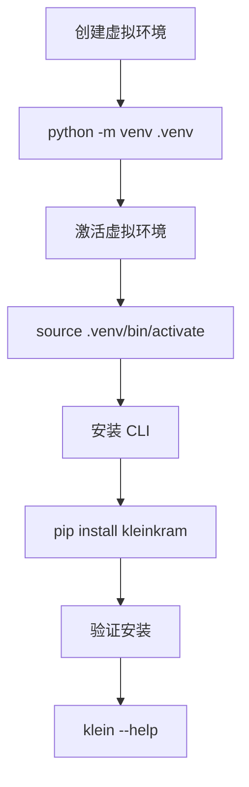
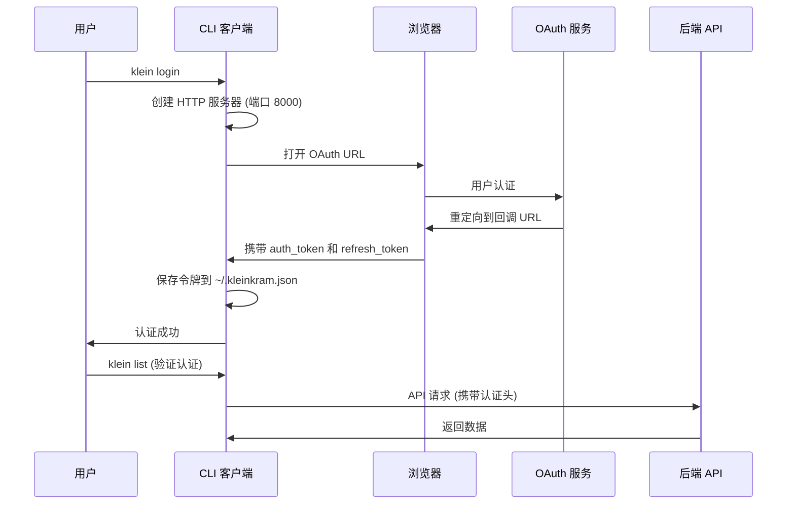

Kleinkram CLI 是与 Kleinkram 平台进行交互的命令行工具,提供文件上传下载、项目管理、任务自动化等核心功能。本文档将引导您完成 CLI 的安装与配置,确保您能够快速开始使用 Kleinkram 进行机器人数据管理。配置文件位于 `~/.kleinkram.json`,存储了端点信息和认证凭据,通过环境自适应机制自动选择正确的服务端点。

## 系统要求与前提条件

Kleinkram CLI 基于 Python 构建,需要 **Python 3.10 或更高版本**。建议使用最新稳定版 Python 以获得最佳兼容性和性能。安装前请确认系统已正确配置 Python 环境,可通过 `python --version` 验证版本信息。CLI 依赖多个核心包,包括用于 HTTP 请求的 `httpx`、AWS S3 兼容存储的 `boto3`、命令行框架 `typer` 和富文本渲染的 `rich`,这些依赖将在安装过程中自动处理。

Sources: [setup.cfg](cli/setup.cfg#L14-L21)

## 安装方式

### 生产环境安装

推荐通过 `pip` 从 PyPI 安装稳定版本,这是最简单且适合大多数用户的方式。遵循 Python 最佳实践,建议在虚拟环境中安装以避免依赖冲突。创建并激活虚拟环境后,执行 `pip install kleinkram` 即可完成安装,该命令会将 `klein` 命令添加到系统 PATH 中。安装完成后,运行 `klein --help` 可查看所有可用命令,验证安装成功。

### 开发环境安装

开发者如需贡献代码或调试 CLI,需从源码安装可编辑版本。首先克隆仓库并进入 CLI 目录,然后创建 Python 3.10 虚拟环境,激活后执行 `pip install -e . -r requirements.txt` 完成开发模式安装和依赖配置。开发环境还应安装 pre-commit hooks 以确保代码质量,执行 `pre-commit install` 即可启用提交前自动检查。开发环境支持运行单元测试和端到端测试,前者通过 `pytest -m "not slow"` 执行,后者需要本地运行后端实例并通过 `klein login` 完成认证。

Sources: [README.md](cli/README.md#L1-L43)

## 配置管理架构

### 配置文件结构

CLI 采用 JSON 格式的配置文件,默认存储在用户主目录下的 `~/.kleinkram.json`。配置对象包含四个核心属性:**版本号**标识 CLI 版本,**已选端点**指定当前使用的服务端点,**端点字典**存储所有可用的端点配置,**凭据字典**保存各端点的认证信息。配置系统通过 `get_config()` 函数加载配置,首次使用时自动创建默认配置对象,后续访问缓存在内存中以提高性能。

Sources: [config.py](cli/kleinkram/config.py#L106-L119)

### 多环境端点管理

Kleinkram 支持三种部署环境:**本地开发环境**默认使用 `localhost:3000` 作为 API 端点,**开发服务器环境**指向 `api.datasets.dev.leggedrobotics.com`,**生产环境**连接到 `api.datasets.leggedrobotics.com`。每个端点包含 API 地址和 S3 存储地址,端点选择逻辑根据 CLI 版本自动判断:开发版本连接开发环境,生产版本连接生产环境,本地开发模式连接本地环境。在 Actions 自动化任务中,环境变量 `KLEINKRAM_API_ENDPOINT` 和 `KLEINKRAM_S3_ENDPOINT` 可覆盖默认端点配置。

| 环境类型 | API 端点 | S3 端点 | 使用场景 |
|---------|---------|---------|---------|
| 本地开发 | `http://localhost:3000` | `http://localhost:9000` | 本地开发调试 |
| 开发服务器 | `https://api.datasets.dev.leggedrobotics.com` | `https://s3.datasets.dev.leggedrobotics.com` | 测试环境集成 |
| 生产环境 | `https://api.datasets.leggedrobotics.com` | `https://s3.datasets.leggedrobotics.com` | 正式数据管理 |
| Actions 环境 | 从环境变量读取 | 从环境变量读取 | 自动化任务执行 |

Sources: [config.py](cli/kleinkram/config.py#L36-L61)

### 端点切换与自定义

使用 `klein endpoint` 命令管理端点配置。不带参数执行时显示所有可用端点及当前选中项,带端点名称执行时切换到指定端点,提供名称、API 地址和 S3 地址三个参数时添加新的自定义端点。例如,`klein endpoint prod` 切换到生产环境,`klein endpoint custom https://api.example.com https://s3.example.com` 添加自定义端点。端点配置变更后自动保存到配置文件,凭据信息按端点隔离存储,切换端点不会丢失其他环境的认证状态。

Sources: [_endpoint.py](cli/kleinkram/cli/_endpoint.py#L27-L56)

## 认证配置

### OAuth 浏览器认证流程

标准认证流程通过 `klein login` 命令启动,CLI 会自动检测可用的浏览器并打开 OAuth 登录页面。认证过程创建临时 HTTP 服务器监听默认端口 8000,用于接收 OAuth 回调。用户在浏览器中完成身份验证后,服务端重定向到回调 URL 并携带认证令牌和刷新令牌,CLI 捕获这些令牌并安全存储到配置文件中。整个流程在 120 秒内完成,超时或失败会提示用户重试。认证完成后,令牌保存在 `~/.kleinkram.json` 中,后续所有 API 请求自动携带认证信息。

Sources: [auth.py](cli/kleinkram/auth.py#L68-L104)

### 无头模式认证

在无图形界面或浏览器不可用的环境(如远程服务器、CI/CD 流水线)中,使用 `klein login --headless` 启动无头认证。CLI 输出认证 URL,用户需在另一设备上打开该 URL 完成登录,然后手动输入获取到的认证令牌和刷新令牌。这种方式适用于自动化脚本和受限环境,但需要人工干预完成令牌传递。

Sources: [auth.py](cli/kleinkram/auth.py#L23-L33)

### API 密钥认证

在 Kleinkram Actions 自动化任务中,执行环境提供 `APIKEY` 环境变量,通过 `klein login --key $APIKEY` 完成非交互式认证。这种认证方式绕过 OAuth 流程,直接使用 API 密钥作为凭据,密钥通过 `KLEINKRAM_API_KEY` 环境变量注入,配置系统检测到该变量时自动创建基于密钥的凭据对象。API 密钥认证具有更高权限,应妥善保管避免泄露。

Sources: [config.py](cli/kleinkram/config.py#L63-L73), [auth.py](cli/kleinkram/auth.py#L207-L211)

### 多 OAuth 提供者支持

CLI 支持多种 OAuth 提供者,默认使用 Google 认证。通过 `--oauth-provider` 参数可选择其他提供者,例如 `klein login --oauth-provider github` 使用 GitHub 认证。支持的提供者包括 `google`、`github` 和用于本地开发的 `fake-oauth`。本地开发环境默认使用 `fake-oauth`,生产和开发环境默认使用 Google。切换提供者不影响已存储的其他提供者凭据,每个端点独立维护认证状态。

Sources: [app.py](cli/kleinkram/cli/app.py#L126-L153)

## 验证安装与故障排除

### 基础验证命令

安装和认证完成后,执行基础命令验证功能正常。`klein --version` 显示当前 CLI 版本,`klein --help` 列出所有可用命令及分类。认证状态通过尝试访问资源验证,例如 `klein list` 列出可访问的项目和任务。CLI 启动时自动检查版本兼容性,如果 CLI 版本与服务器 API 版本不匹配,会显示警告或抛出版本错误。日志文件记录在 `~/.local/state/kleinkram/` (Linux) 或 `~/AppData/Local/kleinkram/` (Windows),便于问题诊断。

Sources: [app.py](cli/kleinkram/cli/app.py#L217-L263)

### 配置兼容性检查

CLI 更新后可能遇到配置文件格式变更,系统在启动时执行兼容性检查。如果检测到不兼容的配置文件,会提示用户确认是否覆盖,选择确认后重置为默认配置。配置系统还支持自动迁移,例如旧版配置中的 S3 端点域名从 `minio.datasets.` 自动更新为 `s3.datasets.`,无需用户干预。

Sources: [config.py](cli/kleinkram/config.py#L164-L205)

### 常见问题与解决方案

| 问题 | 可能原因 | 解决方案 |
|-----|---------|---------|
| `command not found: klein` | 未安装或 PATH 未配置 | 确认虚拟环境已激活,重新安装 CLI |
| 认证失败或令牌过期 | 令牌失效或过期 | 执行 `klein logout` 后重新登录 |
| 端口 8000 被占用 | 回调端口冲突 | 使用 `--headless` 模式或释放端口 |
| 版本不兼容错误 | CLI 与服务器版本不匹配 | 升级 CLI: `pip install --upgrade kleinkram` |
| 配置文件损坏 | 格式错误或版本不兼容 | 删除 `~/.kleinkram.json` 后重新配置 |

## 下一步学习

完成 CLI 安装与配置后,建议按以下顺序深入学习 Kleinkram 的核心功能:

- **[CLI 命令详解](15-cli-ming-ling-xiang-jie)**: 掌握文件上传下载、项目管理等核心命令的使用方法
- **[文件上传与下载](17-wen-jian-shang-chuan-yu-xia-zai)**: 学习批量文件操作和传输优化技巧
- **[Python SDK 集成开发](16-python-sdk-ji-cheng-kai-fa)**: 在 Python 脚本中集成 Kleinkram API 进行自动化开发
- **[开发环境搭建](5-kai-fa-huan-jing-da-jian)**: 如需贡献代码或本地调试,搭建完整开发环境