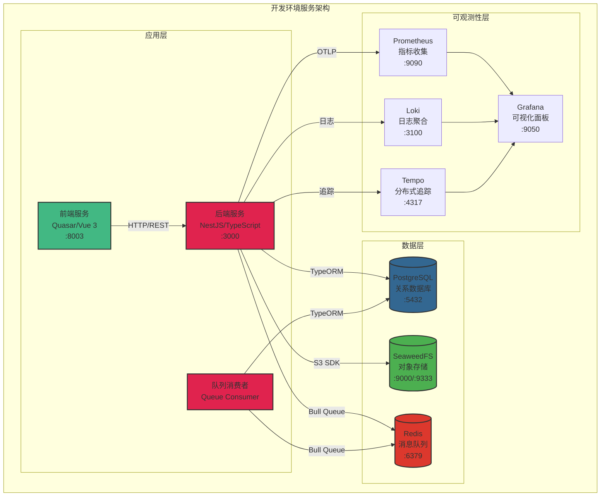

本指南面向中级开发者，系统性地介绍如何在本地构建 Kleinkram 的完整开发环境。Kleinkram 采用容器化微服务架构，通过 Docker Compose 编排多个服务组件，实现前后端分离、数据持久化、对象存储、消息队列和可观测性系统的完整集成。开发环境设计强调隔离性和可重现性，确保开发者能够快速启动项目并保持环境一致性。

## 架构概览

开发环境由六个核心服务组成，形成完整的全栈应用架构。**后端服务**（NestJS）提供 RESTful API 和业务逻辑，**前端服务**（Quasar/Vue 3）提供用户界面，**PostgreSQL** 负责关系型数据存储，**SeaweedFS** 提供 S3 兼容的对象存储能力，**Redis** 支持消息队列和缓存，**可观测性栈**（Prometheus、Grafana、Loki、Tempo）提供监控、日志和分布式追踪能力。所有服务通过 Docker 网络互联，确保服务发现和通信的安全隔离。



Sources: [docker-compose.yml](docker-compose.yml#L1-L200), [docker-compose.dev.yml](docker-compose.dev.yml#L1-L100)

## 系统要求与依赖

开发环境的核心依赖以 Docker 为基础，辅以 Node.js 和 Python 环境用于本地 IDE 代码补全和静态分析。以下表格详细列出所有必需工具及其版本要求，确保环境兼容性。

| 工具类别 | 工具名称 | 最低版本 | 用途说明 | 安装验证命令 |
|:--------|:--------|:--------|:--------|:------------|
| **核心依赖** | Docker | 24.0+ | 容器运行时，承载所有服务 | `docker --version` |
| | Docker Compose | 2.20+ | 多容器编排管理 | `docker compose version` |
| | Git | 2.30+ | 代码版本控制 | `git --version` |
| **开发辅助** | Node.js | 22.x LTS | 本地代码补全和静态分析 | `node --version` |
| | pnpm | 10.30+ | Monorepo 包管理器 | `pnpm --version` |
| | Python | 3.10+ | CLI 工具开发依赖 | `python3 --version` |
| **浏览器** | Chrome/Firefox | 最新版 | 前端开发调试（Safari 存在已知兼容性问题） | - |

Sources: [package.json](package.json#L77-L80), [cli/setup.cfg](cli/setup.cfg#L17-L19), [docs/development/getting-started.md](docs/development/getting-started.md#L9-L20)

## 快速启动流程

### 第一步：克隆仓库与环境变量配置

项目采用 `.env` 文件管理环境变量，提供开箱即用的默认配置。开发者只需克隆仓库即可开始，无需手动配置复杂的环境变量。

```bash
# 克隆仓库
git clone git@github.com:leggedrobotics/kleinkram.git
cd kleinkram

# 检查环境变量文件（已预设开发环境配置）
cat .env
```

环境变量文件包含数据库连接、S3 存储配置、OAuth 认证密钥等关键配置。开发环境下，**Fake OAuth** 功能默认启用（`VITE_USE_FAKE_OAUTH_FOR_DEVELOPMENT=true`），无需配置真实的 Google 或 GitHub OAuth 应用即可登录测试。数据库种子数据功能默认开启（`SEED=true`），首次启动将自动创建测试用户、项目、文件和 Action 模板。

Sources: [.env](.env#L1-L48), [docs/development/try-locally.md](docs/development/try-locally.md#L9-L15)

### 第二步：启动开发环境

使用 Docker Compose 启动所有服务，`--build` 参数确保镜像构建，`--watch` 参数启用文件监听实现热重载。首次启动需要构建 Docker 镜像，耗时约 5-10 分钟，后续启动将复用缓存镜像，启动速度大幅提升。

```bash
# 启动开发环境（推荐：支持热重载）
docker compose up --build --watch

# 或者简化启动（不支持热重载）
docker compose up --build
```

启动过程中，后端服务将自动执行以下初始化流程：首先生成 OpenAPI 文档，然后启动 NestJS 开发服务器，最后根据 `SEED` 环境变量决定是否执行数据库种子数据填充。当日志输出 **"👍 Finished Seeding"** 时，表示所有服务已成功启动并完成初始化。

Sources: [backend/entrypoint.sh](backend/entrypoint.sh#L1-L26), [docs/development/getting-started.md](docs/development/getting-started.md#L45-L63)

### 第三步：验证服务状态

所有服务启动后，可通过以下端口访问各个组件：

| 服务名称 | 访问地址 | 功能说明 |
|:--------|:--------|:--------|
| **前端应用** | http://localhost:8003 | 用户界面，支持 Fake OAuth 登录 |
| **后端 API** | http://localhost:3000 | RESTful API 端点 |
| **API 文档** | http://localhost:3000/api | Swagger UI 交互式文档 |
| **SeaweedFS 控制台** | http://localhost:9333 | 对象存储管理界面 |
| **Grafana 监控** | http://localhost:9050 | 可观测性仪表板（默认无密码） |
| **Prometheus** | http://localhost:9090 | 指标查询界面 |

**重要提示**：建议使用 Chrome 或 Firefox 浏览器访问前端应用。Safari 在本地开发环境下存在已知的兼容性问题，生产环境部署后不受影响。

Sources: [docker-compose.yml](docker-compose.yml#L107-L191), [docs/development/getting-started.md](docs/development/getting-started.md#L65-L78)

## 本地 IDE 配置

虽然应用运行在 Docker 容器中，但本地安装依赖包有助于 IDE 提供代码补全、类型检查和重构功能。项目采用 **pnpm workspace** 管理 Monorepo 结构，包含共享包（`packages/shared`、`packages/validation`、`packages/api-dto`、`packages/backend-common`）和应用（`backend`、`frontend`、`queueConsumer`）。

### Node.js 环境配置

```bash
# 安装 pnpm（如果尚未安装）
npm install -g pnpm@10.30.3

# 安装所有 Node.js 依赖（包括共享包和应用）
pnpm install
```

pnpm 通过硬链接机制节省磁盘空间，依赖包实际存储在全局 store，各项目通过符号链接引用。这种设计在 Monorepo 环境下特别高效，避免重复下载相同依赖。

Sources: [package.json](package.json#L85-L90), [pnpm-workspace.yaml](pnpm-workspace.yaml#L1-L28), [docs/development/getting-started.md](docs/development/getting-started.md#L80-L98)

### Python CLI 开发环境配置

CLI 工具使用 Python 3.10+ 开发，推荐使用 `virtualenv` 创建隔离环境。项目配置了 `pre-commit` 钩子，确保代码格式化（`black`）、静态检查（`flake8`、`mypy`）和导入排序（`isort`）的一致性。

```bash
# 进入 CLI 目录
cd cli

# 创建虚拟环境
virtualenv -ppython3.10 .venv
source .venv/bin/activate  # Linux/macOS
# 或 Windows: .venv\Scripts\activate

# 安装 CLI 及其依赖
pip install -e . -r requirements.txt

# 安装开发依赖（测试、类型检查等）
pip install -r requirements-dev.txt
```

安装完成后，`klein` 命令将全局可用（在虚拟环境激活状态下）。开发者可以通过 `klein endpoint local` 配置 CLI 连接本地后端服务，通过 `klein login --oauth-provider fake-oauth --user 1` 以管理员身份登录（无需浏览器交互）。

Sources: [cli/setup.cfg](cli/setup.cfg#L1-L42), [cli/requirements.txt](cli/requirements.txt#L1-L11), [docs/development/getting-started.md](docs/development/getting-started.md#L100-L108)

### Pre-commit 钩子安装

项目强制使用 pre-commit 钩子确保代码质量，支持 Python（`black`、`flake8`、`isort`）和 JavaScript/TypeScript/Vue（`eslint`、`prettier`）的自动格式化和静态检查。钩子会在每次 `git commit` 时自动运行，拦截不符合规范的代码提交。

```bash
# 安装 pre-commit（需要在项目根目录）
pip install pre-commit

# 安装 Git 钩子
pre-commit install

# 手动运行所有钩子（可选，用于验证）
pre-commit run --all-files
```

如果钩子检查失败（例如代码格式不符合规范），提交将被中止。开发者需要审查自动修改的文件，然后重新提交。这种机制确保代码库始终保持一致的代码风格，减少代码审查中的格式争议。

Sources: [.pre-commit-config.yaml](.pre-commit-config.yaml#L1-L47), [docs/development/getting-started.md](docs/development/getting-started.md#L22-L43)

## 开发工作流与调试

### 数据库种子数据管理

开发环境默认启用数据库种子功能（`SEED=true`），自动创建预设的测试数据，方便开发者快速体验和测试功能。种子数据包括三种角色用户、三个示例项目、五个 Action 模板以及多种格式的测试文件（`.bag`、`.mcap`、`.yaml`）。

| 用户类型 | 邮箱地址 | 角色 | 权限说明 |
|:--------|:--------|:----|:--------|
| **管理员** | admin@kleinkram.dev | ADMIN | 全局访问权限，可查看所有项目 |
| **内部用户** | internal-user@kleinkram.dev | USER | 可创建项目，属于主访问组 |
| **外部用户** | external-user@example.com | USER | 无项目访问权限，用于测试权限隔离 |

若需要从空白数据库开始，修改 `.env` 文件中的 `SEED=false`，然后清理现有数据并重新启动：

```bash
# 停止所有服务并删除数据卷
docker compose down --volumes

# 禁用种子数据
sed -i 's/SEED=true/SEED=false/' .env

# 重新启动（将使用空数据库）
docker compose up --build --watch
```

Sources: [docs/development/getting-started.md](docs/development/getting-started.md#L111-L161), [.env](.env#L27)

### Fake OAuth 登录流程

本地开发环境集成了 Fake OAuth 提供商，模拟真实的 OAuth 认证流程，无需注册 Google 或 GitHub OAuth 应用。开发者可以通过 CLI 或浏览器登录测试用户：

```bash
# 配置 CLI 连接本地后端
klein endpoint local

# 方式一：交互式登录（打开浏览器选择用户）
klein login --oauth-provider fake-oauth

# 方式二：自动选择用户（适用于 CI/CD 或自动化测试）
klein login --oauth-provider fake-oauth --user 1  # 管理员
klein login --oauth-provider fake-oauth --user 2  # 内部用户
klein login --oauth-provider fake-oauth --user 3  # 外部用户
```

浏览器访问前端时，登录页面将显示三个测试用户的快捷选择按钮，点击即可完成登录。这种设计大大简化了开发调试流程，避免频繁的 OAuth 认证跳转。

Sources: [docs/development/getting-started.md](docs/development/getting-started.md#L173-L204), [.env](.env#L29)

### 热重载与文件监听

开发环境通过 Docker Compose 的 `--watch` 参数实现文件监听和热重载。当本地文件修改时，Docker 自动同步变更到容器内，触发相应的重新构建或重启流程。**后端服务**监听 `./backend` 和 `./packages` 目录的 TypeScript 文件变更，通过 NestJS 的 Webpack 热重载机制实现零停机更新。**前端服务**监听 `./frontend` 和 `./packages` 目录，通过 Vite 的模块热替换（HMR）实时更新浏览器界面。

```yaml
# docker-compose.yml 中的文件监听配置示例
develop:
  watch:
    - action: sync  # 同步文件变更
      path: ./backend
      target: /app/backend
      ignore:
        - node_modules/
        - dist/
    - action: rebuild  # 配置文件变更触发重建
      path: ./backend/package.json
```

如果遇到容器内依赖包损坏或模块缺失问题，可以通过删除 Docker 卷并重建解决：

```bash
# 删除应用容器和 node_modules 卷
docker compose rm -sf api-server queue-consumer frontend
docker volume rm kleinkram_backend_node_modules kleinkram_frontend_node_modules

# 重新构建并启动
docker compose up -d --build api-server queue-consumer frontend
```

Sources: [docker-compose.yml](docker-compose.yml#L31-L97), [README.md](README.md#L63-L74)

## 环境变量配置详解

环境变量文件 `.env` 控制所有服务的运行时行为，包括服务端口、数据库连接、对象存储配置和认证密钥。开发环境已预设所有必需变量，开发者通常无需修改。以下分类说明关键配置项：

### 服务 URL 配置

| 变量名 | 默认值 | 说明 |
|:------|:------|:----|
| `SERVER_PORT` | 3000 | 后端 API 监听端口 |
| `FRONTEND_URL` | http://localhost:8003 | 前端访问地址 |
| `BACKEND_URL` | http://localhost:3000 | 后端 API 访问地址 |
| `DOCS_URL` | http://localhost:4000 | 文档站点地址 |

### 数据库配置

| 变量名 | 默认值 | 说明 |
|:------|:------|:----|
| `DB_HOST` | database | 数据库主机名（Docker 网络内） |
| `DB_PORT` | 5432 | 数据库端口 |
| `DB_DATABASE` | dbname | 数据库名称 |
| `DB_USER` | dbuser | 数据库用户名 |
| `DB_PASSWORD` | dbuserpass | 数据库密码 |
| `SEED` | true | 是否启用种子数据填充 |

### S3 对象存储配置（SeaweedFS）

| 变量名 | 默认值 | 说明 |
|:------|:------|:----|
| `S3_ENDPOINT` | localhost | S3 服务地址 |
| `S3_ACCESS_KEY` | pMEKIOCnYJhmssiKZDGU | S3 访问密钥 |
| `S3_SECRET_KEY` | ECnXGyUR5ZrPsxeD5JEWxtI1CMZFMJ8kTJMMAQ5B | S3 密钥 |
| `S3_DATA_BUCKET_NAME` | data | 数据存储桶名称 |
| `S3_ARTIFACTS_BUCKET_NAME` | artifacts | 构件存储桶名称 |

### 安全配置

| 变量名 | 默认值 | 说明 |
|:------|:------|:----|
| `JWT_SECRET` | SECRET | JWT 令牌签名密钥 |
| `VITE_USE_FAKE_OAUTH_FOR_DEVELOPMENT` | true | 启用 Fake OAuth（仅开发环境） |
| `GOOGLE_CLIENT_ID` | - | Google OAuth 客户端 ID（生产环境） |
| `GITHUB_CLIENT_ID` | - | GitHub OAuth 客户端 ID（生产环境） |

**重要**：生产环境部署时，必须修改 `JWT_SECRET` 为强随机字符串，并配置真实的 OAuth 提供商凭据。开发环境的默认密钥仅用于本地测试，切勿用于生产。

Sources: [.env](.env#L1-L48), [docs/development/environment-variables.md](docs/development/environment-variables.md#L1-L83)

## 故障排除指南

### 问题一：容器启动失败或服务不可达

**症状**：`docker compose up` 命令报错，或访问 `http://localhost:3000` 无响应。

**诊断步骤**：
1. 检查 Docker 服务状态：`systemctl status docker`（Linux）或 Docker Desktop 运行状态
2. 查看容器日志：`docker compose logs api-server`
3. 验证端口占用：`lsof -i :3000` 或 `netstat -tuln | grep 3000`

**解决方案**：
```bash
# 清理残留容器和网络
docker compose down --volumes

# 重建所有镜像
docker compose build --no-cache

# 重新启动
docker compose up --build
```

Sources: [README.md](README.md#L63-L74)

### 问题二：模块缺失或 node_modules 损坏

**症状**：容器日志显示 `Cannot find module ...` 错误，或 TypeScript 编译失败。

**原因**：Docker 卷中的 `node_modules` 与宿主机依赖版本不一致，或文件同步导致符号链接损坏。

**解决方案**：
```bash
# 删除应用容器和依赖卷
docker compose rm -sf api-server queue-consumer frontend docs
docker volume rm kleinkram_backend_node_modules \
                  kleinkram_frontend_node_modules \
                  kleinkram_queue_consumer_node_modules \
                  kleinkram_node_modules

# 重新构建并启动
docker compose up -d --build api-server queue-consumer frontend docs
```

Sources: [README.md](README.md#L63-L74)

### 问题三：数据库迁移失败或数据不一致

**症状**：后端启动报错 `relation "xxx" does not exist`，或查询返回意外结果。

**解决方案**：
```bash
# 完全重置数据库
docker compose down --volumes

# 可选：保留种子数据
docker compose up --build

# 或：从空白数据库开始
sed -i 's/SEED=true/SEED=false/' .env
docker compose up --build
```

Sources: [docs/development/try-locally.md](docs/development/try-locally.md#L18-L27)

### 问题四：浏览器兼容性问题

**症状**：Safari 浏览器访问前端时出现白屏、样式错乱或 API 调用失败。

**原因**：本地开发服务器使用自签名证书或特定 CORS 配置，Safari 安全策略更严格。

**解决方案**：使用 Chrome 或 Firefox 浏览器进行开发调试。生产环境部署后，Safari 兼容性问题将自动解决。

Sources: [docs/development/getting-started.md](docs/development/getting-started.md#L76-L78)

## 后续学习路径

开发环境搭建完成后，建议按照以下顺序深入学习：

1. **[系统架构与服务编排](6-xi-tong-jia-gou-yu-fu-wu-bian-pai)**：理解各服务的职责划分、网络拓扑和数据流转路径
2. **[应用结构详解](docs/development/application-structure.md)**：深入代码组织方式、Monorepo 设计模式和模块依赖关系
3. **[后端开发指南](7-api-duan-dian-yu-kong-zhi-qi-she-ji)**：学习 NestJS 控制器设计、TypeORM 实体建模和服务层架构
4. **[前端开发指南](10-vue-zu-jian-jia-gou)**：掌握 Quasar 组件系统、Vue 3 Composition API 和状态管理最佳实践

通过系统化的学习，开发者将全面掌握 Kleinkram 的技术栈和设计哲学，为后续的功能开发和代码贡献奠定坚实基础。